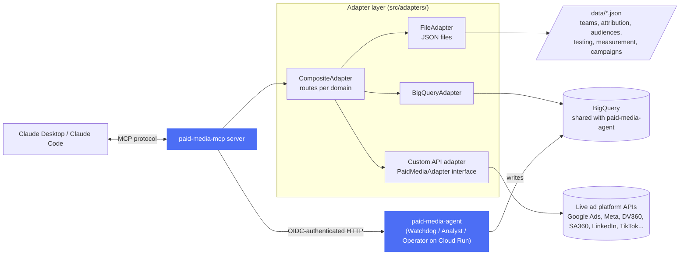

---

## Part of the Paid Media AI Suite

This is one component of a three-part system. See [paid-media-agent](https://github.com/kenlim5656/paid-media-agent) for the full architecture, setup guide, and AGENT.md.

| Component | Role |
|-----------|------|
| **[paid-media-agent](https://github.com/kenlim5656/paid-media-agent)** | Autonomous agents + BigQuery schema DDL — Watchdog, Analyst, Operator on Cloud Run; schema in `schema/bigquery/` |
| **[paid-media-mcp](https://github.com/kenlim5656/paid-media-mcp)** ← you are here | Interactive data server — connects Claude to campaign data and agent outputs |
| **[skills](https://github.com/kenlim5656/skills)** | Interactive skill library — 16+ paid-media skills for Claude Code |


# Paid Media MCP

A [Model Context Protocol (MCP)](https://modelcontextprotocol.io) server template for paid media teams. Connect Claude to your campaign data, team structure, performance history, attribution models, reporting templates, asset library, test-and-learn history, audience library, and measurement setup — so it can answer questions, write reports, debug tracking issues, and assist with analysis directly in your workflow. This is a platform agnostic MCP combining campaign data, institutional knowledge and historical performance across current and past vendors.

**This is a template.** The example data is for a fictional e-commerce company ("Acme Corp"). You replace it with your own.

---

## The paid media agent suite

This MCP is one part of a three-piece toolkit for a Claude-powered paid media workflow:

| Component | What it does |
|---|---|
| **[paid-media-mcp](https://github.com/kenlim5656/paid-media-mcp)** ← you are here | MCP server — connects Claude to your campaign data, team structure, performance history, and institutional knowledge |
| **[paid-media-mcp-setup skills](https://github.com/kenlim5656/skills/tree/main/paid-media-mcp-setup)** | Setup wizard and data import skills — populate your data files from BigQuery, spreadsheets, or platform exports, and keep them current |
| **[paid-media skills](https://github.com/kenlim5656/skills/tree/main/paid-media)** | Campaign strategy and execution skills — DV360, DCO, PPC, CM360 click trackers, and more. Work best when this MCP is connected. |

**How they fit together:**
1. Clone this repo and run the `/paid-media/setup` skill to populate your data files
2. Use `/paid-media/import-data` on a regular cadence to keep campaign and performance data current
3. Use `/paid-media/*` skills for day-to-day campaign work — they use your MCP data automatically when it's connected

---

## Table of Contents

1. [The paid media agent suite](#the-paid-media-agent-suite)
2. [What this does](#what-this-does)
3. [Quick start](#quick-start)
4. [Filling in your data](#filling-in-your-data)
   - [metadata.json](#metadatajson)
   - [accounts.json](#accountsjson)
   - [teams.json](#teamsjson)
   - [team-members.json](#team-membersjson)
   - [campaigns.json](#campaignsjson)
   - [historical-performance.json](#historical-performancejson)
   - [attribution-models.json](#attribution-modelsjson)
   - [reporting-templates.json](#reporting-templatesjson)
   - [assets.json](#assetsjson)
   - [testing.json](#testingjson)
   - [audiences.json](#audiencesjson)
   - [measurement.json](#measurementjson)
   - [platforms.json](#platformsjson)
5. [What Claude can do](#what-claude-can-do)
6. [Data sources and adapters](#data-sources-and-adapters)
   - [Why JSON by default](#why-json-by-default)
   - [When to use which source](#when-to-use-which-source)
   - [Option A — Local JSON files (default)](#option-a--local-json-files-default)
   - [Option B — BigQuery or data warehouse](#option-b--bigquery-or-data-warehouse)
   - [Option C — Live platform API](#option-c--live-platform-api)
   - [Option D — Multiple sources combined](#option-d--multiple-sources-combined)
7. [Troubleshooting](#troubleshooting)
8. [Project structure](#project-structure)

---

## What this does

### Platform-agnostic by design

Most AI integrations for paid media are built by the platforms themselves — Google's MCP gives Claude knowledge of Google Ads, Meta's MCP gives Claude knowledge of Meta. That's useful, but it means Claude only sees one slice of your program at a time and can't answer cross-channel questions.

This MCP is different. It is **platform-agnostic**: it connects Claude to *your entire paid media operation*, regardless of which channels, DSPs, networks, or agencies you use. Claude gets a unified view of every platform you run, every team that manages them, and every dollar you spend — all at once.

### Three layers of context in one connection

**1. Live ad platform data**
Every campaign across every channel — Meta, Google Ads, DV360, SA360, LinkedIn, TikTok, Amazon, and more. Budgets, objectives, targeting, performance metrics, and status all in one place. No more switching between platform UIs to answer a basic question.

**2. Institutional knowledge**
Information that lives in spreadsheets, Confluence pages, agency decks, and people's heads — captured once and always available:
- How your team is structured and who owns what
- Your attribution rules and how you measure conversions
- Your audience strategy: first-party segments, data providers, lookalike approach
- Your tracking setup: tag management, pixels, Conversion APIs, CM360 u-variables
- Your asset library: where files live, naming conventions, per-platform specs
- Your test-and-learn history: what you've tried, what worked, and why — across not just creative tests but DSP evaluations, agency reviews, ad network trials, and tool assessments

**3. Historical data**
Performance records over time, benchmarks by platform and objective, and completed test results. Claude can compare current performance against your own historical baseline — not just generic industry averages.

### What this means in practice

Without this, Claude gives generic paid media advice. With it, Claude gives advice that is specific to your program, your data, and your institutional history:

> "Your Q2 Meta prospecting campaign is running 2.4x ROAS against your 4.0x target. Retargeting is at 12.3x — the prospecting pool may be too cold. Based on your April LAL test, tightening to 1% and adding the purchaser suppression list drove 18% lower CPA. That's the move here."

> "You ran a DSP evaluation last year. DV360 beat The Trade Desk on CPA by 11%, but the note says TTD's frequency management advantage will grow as cookies deprecate. It's been 14 months — worth re-running that test."

> "Your social agency contract is up in Q4. The evaluation from 2025 showed Social Natives outperformed Spark & Co. on CPA by 18% and 3x creative output. That history is already here if you want to use it in the RFP process."

These answers are only possible when campaign data, institutional knowledge, and historical records exist in the same context — which is exactly what this MCP provides.

### Architecture



`paid-media-mcp` reads campaign data, institutional knowledge, and agent outputs (mostly via BigQuery or local JSON) and can call `paid-media-agent`'s HTTP routes for live queries and guardrail-checked actions. See [paid-media-agent](https://github.com/kenlim5656/paid-media-agent) for the write-path/execution side of the suite.

---

## Quick start

### Prerequisites

- [Node.js 18+](https://nodejs.org/)
- [Claude Desktop](https://claude.ai/download) (for connecting Claude)
- Git

### Step 1 — Clone and install

> After cloning, run `bash scripts/install-hooks.sh` once to install the
> pre-commit guard against committing private assets.

```bash
git clone https://github.com/kenlim5656/paid-media-mcp.git
cd paid-media-mcp
npm install
```

### Step 2 — Fill in your data

Edit the JSON files in the `data/` folder. Each file has detailed examples. See the [Filling in your data](#filling-in-your-data) section for field-by-field guidance.

At minimum, fill in:
- `data/metadata.json` — your company name
- `data/accounts.json` — your ad accounts
- `data/teams.json` — your team(s)

The server will start even if other files are missing or partially filled.

### Step 3 — Build

```bash
npm run build
```

For development without building (requires `tsx`):

```bash
npm run dev
```

### Step 4 — Connect to Claude Desktop

Open your Claude Desktop config file:
- **Mac:** `~/Library/Application Support/Claude/claude_desktop_config.json`
- **Windows:** `%APPDATA%\Claude\claude_desktop_config.json`

Add the following (replace the paths with your actual absolute paths):

```json
{
  "mcpServers": {
    "paid-media": {
      "command": "node",
      "args": ["/absolute/path/to/paidmedia-mcp/dist/index.js"],
      "env": {
        "PAID_MEDIA_DATA_DIR": "/absolute/path/to/paidmedia-mcp/data"
      }
    }
  }
}
```

**To find your absolute path**, run this from the project folder:

```bash
pwd
```

Copy the output and append `/dist/index.js` for the `args` value and `/data` for `PAID_MEDIA_DATA_DIR`.

### Step 5 — Restart Claude Desktop

Fully quit and reopen Claude Desktop. You should see a hammer icon (🔨) in the chat input — click it to verify the paid-media tools are listed.

### Updating data

After editing files in `data/`, restart Claude Desktop (or the MCP server process) for changes to take effect. The server loads data files at startup.

---

## Filling in your data

### `metadata.json`

Basic company info. Used in report headers and resource descriptions.

```json
{
  "metadata": {
    "company_name": "Your Company Name",
    "industry": "E-commerce",
    "primary_currency": "USD",
    "fiscal_year_start": "01-01",
    "last_updated": "2026-05-31"
  }
}
```

| Field | Required | Notes |
|---|---|---|
| `company_name` | Yes | Appears in Claude's context |
| `industry` | No | Helps Claude give relevant benchmarks and advice |
| `primary_currency` | Yes | ISO 4217 code (USD, EUR, GBP, etc.) |
| `fiscal_year_start` | Yes | MM-DD format |
| `last_updated` | Yes | ISO date — update when you refresh data |

---

### `accounts.json`

One entry per ad account. Each account belongs to exactly one team.

```json
{
  "accounts": [
    {
      "id": "acc_brand_gads",
      "name": "Brand — Google Ads",
      "platform": "google_ads",
      "platform_account_id": "123-456-7890",
      "team_id": "team_brand",
      "status": "active",
      "currency": "USD",
      "timezone": "America/New_York",
      "monthly_budget": 50000,
      "notes": "Brand campaigns only"
    }
  ]
}
```

| Field | Required | Notes |
|---|---|---|
| `id` | Yes | Your internal ID — used in campaigns.json and teams.json |
| `name` | Yes | Human-readable name for Claude to display |
| `platform` | Yes | See [platform values](#platform-values) below |
| `platform_account_id` | Yes | The actual ID shown in the platform UI (e.g. Google Ads customer ID) |
| `team_id` | Yes | Must match an `id` in `teams.json` |
| `status` | Yes | `active` or `inactive` |
| `currency` | Yes | ISO 4217 |
| `timezone` | Yes | IANA timezone string |
| `monthly_budget` | No | Used for pacing analysis |
| `notes` | No | Free text — Claude reads this |

**Platform values:** `google_ads` · `meta` · `dv360` · `youtube` · `linkedin` · `tiktok` · `twitter_x` · `pinterest` · `snapchat` · `amazon` · `other`

---

### `teams.json`

One entry per media team. This is where you capture the strategic context Claude needs to give relevant advice.

```json
{
  "teams": [
    {
      "id": "team_brand",
      "name": "Brand & Awareness",
      "description": "Manages upper-funnel brand campaigns focused on reach and video.",
      "objectives": ["awareness", "reach", "video_views"],
      "primary_kpis": ["impressions", "reach", "cpm", "brand_lift"],
      "account_ids": ["acc_brand_gads", "acc_brand_dv360"],
      "member_ids": ["user_sarah", "user_james"],
      "lead_id": "user_sarah",
      "platforms": ["google_ads", "dv360", "youtube"],
      "reporting_cadence": "weekly",
      "budget_owner": "vp_marketing",
      "notes": "Brand lift studies run quarterly. All campaigns follow brand safety guidelines."
    }
  ]
}
```

| Field | Required | Notes |
|---|---|---|
| `id` | Yes | Referenced by accounts and campaigns |
| `objectives` | Yes | List from: `awareness` `reach` `traffic` `engagement` `video_views` `lead_generation` `app_installs` `conversions` `catalog_sales` `store_visits` |
| `primary_kpis` | Yes | Free-text metric names — Claude uses these when reviewing performance |
| `account_ids` | Yes | Must match IDs in `accounts.json` |
| `member_ids` | Yes | Must match IDs in `team-members.json` |
| `lead_id` | Yes | Team lead — must be in `member_ids` |
| `reporting_cadence` | Yes | `daily` `weekly` `biweekly` `monthly` |
| `notes` | No | Put key context here: targets, processes, constraints |

**Tip:** The `notes` and `description` fields are the most valuable for Claude. Include:
- ROAS/CPA/CPL targets
- Key rules or constraints (e.g. "brand safe only")
- Important processes (e.g. "budget reviews every Monday")
- Links or references to external docs

---

### `team-members.json`

One entry per person. Members can belong to multiple teams.

```json
{
  "team_members": [
    {
      "id": "user_mike",
      "name": "Mike Rodriguez",
      "email": "mike@yourcompany.com",
      "role": "director",
      "team_ids": ["team_performance"],
      "platform_specialties": ["google_ads", "meta"],
      "responsibilities": [
        "Performance team leadership",
        "ROAS and CPA target setting",
        "Budget allocation across channels"
      ],
      "notes": "Primary stakeholder for attribution model decisions."
    }
  ]
}
```

| Field | Required | Notes |
|---|---|---|
| `id` | Yes | Must match `member_ids` in teams.json |
| `role` | Yes | `media_buyer` `media_planner` `analyst` `strategist` `manager` `director` `other` |
| `team_ids` | Yes | Array — analysts or shared staff can be on multiple teams |
| `platform_specialties` | Yes | Which platforms they work in day-to-day |
| `responsibilities` | Yes | Free-text list — Claude uses this to route questions to the right person |
| `notes` | No | Useful for capturing context like certifications, agency relationships, or ownership areas |

---

### `campaigns.json`

One entry per campaign. This is the largest and most important data file.

```json
{
  "campaigns": [
    {
      "id": "camp_perf_search_001",
      "name": "Performance Search — Always On",
      "platform": "google_ads",
      "account_id": "acc_perf_gads",
      "team_id": "team_performance",
      "status": "active",
      "objective": "conversions",
      "budget": {
        "type": "daily",
        "amount": 2000,
        "currency": "USD",
        "pacing": "standard"
      },
      "start_date": "2026-01-01",
      "end_date": null,
      "targeting": {
        "geo": ["US"],
        "devices": ["desktop", "mobile"],
        "keyword_themes": ["branded", "competitor", "category"]
      },
      "funnel_stage": "lower",
      "tags": ["always-on", "search", "performance"],
      "notes": "Target ROAS: 5.0x. Smart Bidding tROAS strategy."
    }
  ]
}
```

**Budget types:** `daily` · `lifetime` · `monthly`

**Objective values:** `awareness` · `reach` · `traffic` · `engagement` · `video_views` · `lead_generation` · `app_installs` · `conversions` · `catalog_sales` · `store_visits`

**Funnel stages:** `upper` · `mid` · `lower`

**Status values:** `active` · `paused` · `ended` · `draft` · `archived`

**Targeting fields** (all optional):

| Field | Example |
|---|---|
| `geo` | `["US", "CA", "GB"]` |
| `audience_segments` | `["lookalike_1pct_purchasers", "in-market_home_goods"]` |
| `age_range` | `{ "min": 25, "max": 54 }` |
| `gender` | `"all"` · `"male"` · `"female"` |
| `devices` | `["desktop", "mobile", "tablet", "connected_tv"]` |
| `keyword_themes` | `["branded", "competitor", "generic"]` |
| `custom_audiences` | `["cart_abandoners_14d", "crm_suppression"]` |

**Tags tip:** Tags are searchable. Use them consistently for filtering — e.g. `q2-2026`, `always-on`, `brand`, `retargeting`, `test`.

---

### `historical-performance.json`

Contains two sections: daily records and benchmarks.

#### Records

One entry per campaign per day. Include whatever metrics you have — rate metrics are re-calculated automatically when aggregating.

```json
{
  "records": [
    {
      "campaign_id": "camp_perf_search_001",
      "date": "2026-05-01",
      "metrics": {
        "impressions": 125000,
        "clicks": 4200,
        "spend": 1850.00,
        "conversions": 310,
        "conversion_value": 12400.00
      }
    }
  ]
}
```

**Available metric fields:**

| Metric | Description |
|---|---|
| `impressions` | Total ad impressions |
| `clicks` | Total clicks |
| `spend` | Total spend in account currency |
| `reach` | Unique users reached |
| `frequency` | Average impressions per user |
| `ctr` | Click-through rate (%) |
| `cpc` | Cost per click |
| `cpm` | Cost per 1,000 impressions |
| `cpa` | Cost per acquisition/conversion |
| `roas` | Return on ad spend |
| `conversions` | Total conversion events |
| `conversion_value` | Revenue value of conversions |
| `video_views` | Video view count |
| `video_view_rate` | Percentage who watched |
| `view_through_conversions` | View-assisted conversions |
| `custom_metrics` | Any additional metrics as key-value pairs |

**Tip:** You don't need to pre-calculate rate metrics (CTR, CPC, ROAS). The server calculates them when aggregating. Just include the raw counts.

**How to export data:** Most platforms let you download daily campaign performance as CSV. Use a tool like Google Sheets or Python to convert to this JSON format. See [data/historical-performance.json](data/historical-performance.json) for the full structure.

#### Benchmarks

Industry reference points for comparison. Optional but makes performance analysis much richer.

```json
{
  "benchmarks": [
    {
      "platform": "google_ads",
      "objective": "conversions",
      "industry": "e-commerce",
      "avg_ctr": 2.69,
      "avg_cpc": 1.33,
      "avg_cpa": 33.52,
      "avg_roas": 3.5
    }
  ]
}
```

Use published industry benchmarks from WordStream, Meta, Google, or your agency. Update annually.

---

### `attribution-models.json`

Documents how you measure conversions — not connected to live platforms, purely descriptive. Claude uses this to explain your measurement setup and make recommendations.

```json
{
  "attribution_configurations": [
    {
      "id": "attr_last_click_30d",
      "name": "Last Click — 30-Day",
      "model": "last_click",
      "window": {
        "click": 30,
        "view": 0,
        "unit": "days"
      },
      "platforms_applied": ["google_ads", "meta"],
      "conversion_events": ["purchase", "lead_form_submit"],
      "cross_device": false,
      "view_through_enabled": false,
      "description": "100% credit to the last clicked ad within 30 days.",
      "use_cases": [
        "Bottom-funnel campaign optimization",
        "Simple baseline for cross-channel comparison"
      ],
      "notes": "Over-credits search/retargeting; undervalues prospecting."
    }
  ]
}
```

**Model values:** `last_click` · `first_click` · `linear` · `time_decay` · `position_based` · `data_driven` · `custom`

**Tip:** Add one entry per meaningful configuration you use — e.g. one for Google Ads, one for Meta, one for cross-channel analysis. The `use_cases` and `notes` fields are especially valuable for Claude's analysis.

---

### `reporting-templates.json`

Defines the structure of your reports and dashboards. Claude uses these when generating reports to follow the right format for the right audience.

```json
{
  "reporting_templates": [
    {
      "id": "tmpl_weekly_team",
      "name": "Weekly Performance Report",
      "type": "performance_summary",
      "audience": "media_team",
      "cadence": "weekly",
      "metrics_included": ["spend", "conversions", "roas", "cpa"],
      "dimensions": ["campaign", "platform", "date"],
      "visualizations": ["spend_by_campaign_bar", "roas_trend_line"],
      "delivery_format": ["google_sheets", "slack"],
      "sections": [
        {
          "title": "Week Summary",
          "description": "Overall performance vs. prior week and vs. targets.",
          "metrics": ["spend", "conversions", "roas"]
        },
        {
          "title": "Campaign Scorecards",
          "description": "One row per active campaign with pacing status.",
          "metrics": ["spend", "conversions", "cpa", "roas"]
        },
        {
          "title": "Action Items",
          "description": "Specific actions to take next week.",
          "metrics": []
        }
      ]
    }
  ]
}
```

**Audience values:** `executive` · `media_team` · `client` · `internal`

**Type values:** `performance_summary` · `pacing` · `budget_flight` · `audience_insights` · `creative_analysis` · `channel_mix` · `attribution_path` · `executive_summary` · `custom`

**Tip:** The `sections` array is the most important part — it's the outline Claude follows when writing a report. Make section descriptions as specific as possible.

---

### `assets.json`

Documents your creative asset library and per-platform specs. Claude uses this to answer asset questions, check spec compliance, and guide campaign trafficking.

```json
{
  "asset_library": {
    "dam_system": "Bynder",
    "dam_url": "https://yourcompany.bynder.com",
    "access_instructions": "Request access via IT helpdesk. Login with SSO.",
    "brand_guidelines_url": "https://yourcompany.bynder.com/brand-guidelines",
    "copy_guidelines_url": "https://yourcompany.bynder.com/copy-guidelines",
    "categories": [
      {
        "id": "cat_social_video",
        "name": "Social Video",
        "type": "video",
        "location_url": "https://yourcompany.bynder.com/collections/social-video",
        "naming_convention": "{brand}_{campaign}_{duration}s_{platform}_{version}",
        "specs": [
          {
            "platform": "meta",
            "format": "MP4 or MOV",
            "dimensions": "1080x1080, 1080x1920, 1920x1080",
            "max_file_size": "4GB",
            "duration_max": "60s (Reels), 15s (Stories)",
            "notes": "Include captions — 85% watch without sound"
          }
        ]
      }
    ]
  }
}
```

**Asset type values:** `image` · `video` · `copy` · `audio` · `html5` · `document` · `other`

**Tip:** The `specs` array per category is especially valuable — Claude can answer "what do I need to traffic this campaign on TikTok?" directly from this data.

---

### `testing.json`

Documents your entire test-and-learn program: methodology, tools, and every test across two categories:

- **In-campaign A/B tests** — creative, audience, bidding, landing page, copy, format, and offer experiments run within or across campaigns
- **Vendor and partner evaluations** — structured assessments of DSPs, ad networks, agencies, ad platforms, and measurement tools

Both categories live in the same `tests` array and are queried with the same tools. This gives Claude a unified institutional memory of every experiment and evaluation your team has run, making it the record of what works — and what doesn't — across the full paid media operation.

```json
{
  "testing_program": {
    "methodology": {
      "confidence_threshold": 95,
      "require_stat_sig": true,
      "minimum_sample_size": 1000,
      "minimum_test_duration_days": 14,
      "minimum_detectable_effect_pct": 10,
      "winner_criteria": "≥10% lift at 95% confidence, minimum 14 days runtime. If stat sig not achieved, test is inconclusive — retain prior best practice."
    },
    "tools": [
      {
        "id": "tool_meta_ab",
        "name": "Meta A/B Testing (native)",
        "type": "platform_native",
        "platform": "meta",
        "used_for": ["Creative A/B tests", "Audience split tests"]
      }
    ],
    "tests": [
      {
        "id": "test_001",
        "name": "UGC vs Brand Creative",
        "hypothesis": "UGC content will drive lower CPA on Meta prospecting due to higher thumb-stop rate.",
        "status": "completed",
        "type": "creative",
        "platform": "meta",
        "variants": [
          { "id": "v_control", "name": "Brand Creative", "description": "Polished brand video", "is_control": true },
          { "id": "v_ugc", "name": "UGC Video", "description": "Creator-style mobile video", "is_control": false }
        ],
        "results": {
          "winner_variant_id": "v_ugc",
          "stat_sig_achieved": true,
          "confidence_level": 97,
          "primary_metric": "CPA",
          "primary_metric_lift_pct": -23,
          "conclusion": "UGC drove 23% lower CPA.",
          "action_taken": "Scaled UGC — producing 2 new variants monthly."
        }
      },
      {
        "id": "test_dsp_001",
        "name": "DSP Evaluation: DV360 vs. The Trade Desk",
        "hypothesis": "TTD's UID2.0 identity solution will deliver better prospecting efficiency than DV360 for upper-funnel display.",
        "status": "completed",
        "type": "dsp",
        "team_id": "team_programmatic",
        "start_date": "2026-01-06",
        "end_date": "2026-03-28",
        "vendor_context": {
          "subject": "DV360 vs. The Trade Desk",
          "incumbent": "DV360",
          "challenger": "The Trade Desk",
          "budget_tested": 120000,
          "contract_value": 0,
          "evaluation_criteria": ["Prospecting CPA", "Viewable impression rate", "Frequency control", "Reporting transparency"],
          "stakeholders": ["Head of Programmatic", "Finance", "Legal"],
          "recommendation": "Retain DV360 as primary DSP. 11% lower CPA and superior CM360 integration. Re-evaluate in 12 months as cookie deprecation progresses."
        },
        "variants": [
          { "id": "v_dv360", "name": "DV360 (Control)", "description": "$60K, DV360 Optimized Targeting + floodlight conversion tracking", "is_control": true },
          { "id": "v_ttd", "name": "The Trade Desk", "description": "$60K, TTD AI bidding + UID2.0 cross-device reach", "is_control": false }
        ],
        "results": {
          "winner_variant_id": "v_dv360",
          "stat_sig_achieved": true,
          "confidence_level": 95,
          "primary_metric": "prospecting_CPA",
          "primary_metric_lift_pct": -11,
          "conclusion": "DV360 11% lower CPA ($34.20 vs $38.50). TTD showed 22% better cross-device frequency control.",
          "action_taken": "DV360 retained. TTD access maintained for re-evaluation in 2027."
        }
      }
    ]
  }
}
```

| Field | Required | Notes |
|---|---|---|
| `methodology.confidence_threshold` | Yes | 90 or 95 are most common |
| `methodology.winner_criteria` | Yes | Plain-English rule — Claude quotes this when analyzing tests |
| `tests[].hypothesis` | Yes | Claude uses this to evaluate whether the test was well-designed |
| `tests[].type` | Yes | See type values below |
| `tests[].results.primary_metric_lift_pct` | No | Negative = improvement for cost metrics (CPA, CPC) |
| `tests[].vendor_context` | No | Populate for dsp/agency/ad_network/platform/tool tests |
| `tests[].vendor_context.evaluation_criteria` | No | List of KPIs or factors used to determine the winner |
| `tests[].vendor_context.recommendation` | No | Final recommendation — quoted by Claude when reviewing past evaluations |

**In-campaign test types:** `creative` · `audience` · `bidding` · `landing_page` · `copy` · `format` · `offer`

**Vendor/partner evaluation types:** `dsp` · `agency` · `ad_network` · `platform` · `tool`

**Catch-all:** `other`

**Test status values:** `planned` · `active` · `completed` · `paused` · `abandoned`

**Tip:** Both categories are queried by the same `list_tests` and `get_test_learnings` tools. You can filter by `type: "dsp"` to pull only DSP evaluations, or leave the filter blank to see all tests and evaluations together. The more history you document — across both categories — the more Claude can surface institutional knowledge when you need it.

---

### `audiences.json`

Documents your full audience infrastructure: first-party segments, contracted data providers, data onboarding platforms, lookalike strategy, and third-party overlay layers.

```json
{
  "audience_library": {
    "business_unit": "Consumer",
    "first_party_audiences": [
      {
        "id": "aud_purchasers_180d",
        "name": "Past Purchasers — 180 Days",
        "type": "pixel_based",
        "description": "All purchasers in the last 180 days.",
        "size_estimate": 45000,
        "platforms_available": ["meta", "google_ads"],
        "refresh_cadence": "daily",
        "tags": ["purchasers", "lookalike-seed"]
      }
    ],
    "data_providers": [
      {
        "id": "dp_oracle",
        "name": "Oracle Data Cloud",
        "contract_status": "active",
        "segments_available": ["In-Market: Home & Garden"],
        "platforms_available": ["dv360", "google_ads"],
        "contract_end_date": "2026-12-31"
      }
    ],
    "onboarding_platforms": [
      {
        "id": "ob_liveramp",
        "name": "LiveRamp",
        "type": "data_onboarding",
        "platforms_connected": ["meta", "google_ads", "dv360"],
        "use_cases": ["CRM list onboarding", "Identity resolution"]
      }
    ],
    "lookalike_strategy": {
      "default_expansion_pct": 1,
      "entries": [
        {
          "seed_audience_id": "aud_purchasers_180d",
          "seed_audience_name": "Past Purchasers — 180 Days",
          "platform": "meta",
          "expansion_percentages": [1, 2, 5],
          "best_performing_expansion": 1
        }
      ]
    },
    "third_party_layers": [
      {
        "id": "3p_in_market",
        "name": "In-Market: Your Category",
        "provider": "Google",
        "category": "in-market",
        "platforms_available": ["google_ads", "dv360"],
        "is_default": true,
        "is_best_performer": true,
        "cpm_premium_estimate": 0.50
      }
    ]
  }
}
```

**First-party audience types:** `crm_list` · `pixel_based` · `customer_match` · `email_list` · `app_users` · `lookalike_seed` · `suppression` · `other`

**Onboarding platform types:** `clean_room` · `data_onboarding` · `identity_resolution` · `cdp`

**Tip:** Set `is_default: true` on audience layers you apply to every campaign, and `is_best_performer: true` on layers with proven efficiency gains — Claude uses both flags to make targeting recommendations.

---

### `measurement.json`

Documents your full tracking and measurement infrastructure: tag management, pixels, Conversion APIs, CM360/Floodlight setup, website data layer, and measurement partners.

```json
{
  "measurement_setup": {
    "tag_management": {
      "system": "google_tag_manager",
      "container_id": "GTM-XXXXXXX",
      "implementation_type": "hybrid",
      "server_side_endpoint": "https://sst.yourcompany.com"
    },
    "pixels_and_tags": [
      {
        "id": "pixel_meta",
        "name": "Meta Pixel",
        "platform": "meta",
        "pixel_id": "XXXXXXXXXXXXXXXX",
        "implementation": "both",
        "events_tracked": ["PageView", "AddToCart", "Purchase"],
        "custom_parameters": ["value", "currency", "order_id"]
      }
    ],
    "conversion_apis": [
      {
        "id": "capi_meta",
        "platform": "meta",
        "api_name": "Meta Conversions API (CAPI)",
        "implementation": "both",
        "events_sent": ["Purchase", "Lead"],
        "match_rate_estimate_pct": 87,
        "deduplication_method": "event_id matched client-side and server-side"
      }
    ],
    "cm360": {
      "account_id": "XXXXXXX",
      "floodlight_configuration_id": "FL-XXXXXXXX",
      "u_variables": [
        { "variable": "u1", "name": "order_id", "type": "string", "description": "Unique order ID for deduplication" },
        { "variable": "u2", "name": "order_value", "type": "number", "description": "Order revenue in USD" }
      ]
    },
    "website_data_capture": {
      "data_layer_implemented": true,
      "data_layer_spec_url": "https://docs.yourcompany.com/datalayer",
      "data_layer_variables": ["pageType", "transactionId", "transactionRevenue", "userId"],
      "analytics_platform": "Google Analytics 4",
      "analytics_property_id": "G-XXXXXXXXXX",
      "first_party_cookies_implemented": true,
      "cookie_domain": ".yourcompany.com",
      "cookie_session_duration": "13 months",
      "cookie_data_captured": ["_ga", "_gcl_aw (GCLID)", "_fbc (Meta click ID)"]
    },
    "measurement_partners": [
      {
        "id": "mp_mmm",
        "name": "Your MMM Provider",
        "type": "mmm",
        "status": "active",
        "platforms_covered": ["google_ads", "meta", "dv360"],
        "cadence": "quarterly"
      }
    ]
  }
}
```

**Tag management system values:** `google_tag_manager` · `tealium` · `adobe_launch` · `segment` · `mparticle` · `manual` · `other`

**Implementation type values:** `client_side` · `server_side` · `hybrid`

**Measurement partner types:** `mmm` · `incrementality` · `brand_lift` · `attribution` · `analytics` · `identity` · `other`

**Tip:** The `cm360.u_variables` section is especially useful — Claude can explain what each u-variable captures and help troubleshoot Floodlight discrepancies when you reference specific variable names.

---

### `platforms.json`

Documents GMP bulk upload schemas for DV360 (SDF v7), SA360 (Bulksheet), and CM360 (Trafficking Sheet). Claude uses this to generate upload-ready files and to enforce your org's naming conventions and field defaults.

Each platform entry has an `entity_types` map (each entity type has a `fields` array) and an `org_defaults` object where you set your company's standard values.

```json
{
  "platforms_config": {
    "platforms": {
      "dv360": {
        "name": "Display & Video 360",
        "format": "SDF v7 CSV",
        "entity_types": {
          "line_item": {
            "fields": [
              {
                "name": "Line Item Id",
                "required": true,
                "description": "Leave blank for new line items; SDF ID for existing",
                "valid_values": "Blank (new) or existing SDF ID"
              },
              {
                "name": "Line Item Type",
                "required": true,
                "description": "Line item buying type",
                "valid_values": "LINE_ITEM_TYPE_DISPLAY_DEFAULT | LINE_ITEM_TYPE_VIDEO_DEFAULT | LINE_ITEM_TYPE_YOUTUBE_AND_PARTNERS_VIDEO_SEQUENCE"
              }
            ]
          }
        },
        "org_defaults": {
          "notes": "SDF version: 7. Always download the existing SDF before uploading edits.",
          "naming_conventions": {
            "line_item": "{brand}_{tactic}_{audience}_{geo}_{quarter}_{year}"
          },
          "field_defaults": {
            "Line Item - Status": "Draft",
            "Line Item - Budget Type": "Amount"
          }
        }
      },
      "sa360": { },
      "cm360": { }
    }
  }
}
```

**Entity types by platform:**

| Platform | Entity types |
|---|---|
| `dv360` | `campaign`, `insertion_order`, `line_item`, `ad_group` |
| `sa360` | `campaign`, `ad_group`, `keyword`, `responsive_search_ad` |
| `cm360` | `placement`, `ad`, `creative` |

**Org defaults tip:** Populate `naming_conventions` and `field_defaults` for every entity type your team regularly creates. Claude uses these to pre-fill the bulk upload files it generates, saving significant trafficking time.

---

## What Claude can do

The server exposes **68 tools** across 16 categories, **17 MCP resources**, and **15 pre-built prompt templates**.

| Category | Tools |
|---|---|
| Campaigns & accounts | `list_campaigns`, `get_campaign`, `list_accounts`, `get_account` |
| Teams | `list_teams`, `get_team`, `get_team_for_account`, `list_team_members`, `get_team_member` |
| Performance | `get_campaign_performance`, `get_team_performance`, `get_benchmarks` |
| Attribution | `list_attribution_models`, `get_attribution_model`, `compare_attribution_models` |
| Reporting | `list_reporting_templates`, `get_reporting_template`, `build_performance_report` |
| Assets | `get_asset_library`, `list_asset_categories`, `get_asset_category`, `get_asset_specs` |
| Testing | `get_testing_methodology`, `list_tests`, `get_test`, `get_test_learnings` |
| Audiences | `get_audience_library_overview`, `list_first_party_audiences`, `list_data_providers`, `get_lookalike_strategy`, `list_third_party_audience_layers`, `get_onboarding_platforms` |
| Measurement | `get_measurement_overview`, `get_tag_management`, `list_pixels_and_tags`, `list_conversion_apis`, `get_cm360_setup`, `get_website_data_capture`, `list_measurement_partners` |
| GMP bulk upload | `list_bulk_upload_platforms`, `get_bulk_upload_schema`, `get_platform_org_defaults`, `get_bulk_upload_instructions` |
| Analytics _(BQ)_ | `get_daily_performance`, `get_ad_performance`, `get_keyword_performance`, `get_pacing_report`, `get_channel_efficiency`, `get_roas_comparison`, `get_campaign_performance_report` |
| Account analytics _(BQ)_ | `get_company_profile`, `get_company_sessions`, `get_company_engagement`, `get_target_account_activity`, `get_target_account_funnel`, `get_dark_funnel_coverage` |
| Identity & signals _(BQ)_ | `list_identity_namespaces`, `get_identity_namespace`, `get_identity_signal_coverage`, `query_account_journey` |
| Data governance _(BQ)_ | `get_watchdog_alerts`, `check_signal_capture_health`, `detect_crm_null_fields` |
| Agent integration _(BQ)_ | `get_analyst_insights`, `get_attribution_results`, `get_attribution_run_history`, `get_pending_approvals`, `trigger_agent_run` |
| Media actions _(BQ)_ | `push_audience_suppression`, `reallocate_media_budget` |

Tools marked _(BQ)_ require BigQuery mode (`PAID_MEDIA_GCP_PROJECT` env var set;
the legacy name `BIGQUERY_PROJECT_ID` still works but logs a deprecation warning).

**→ [Full tool, resource, prompt reference, and example conversations: TOOLS.md](./TOOLS.md)**

---

## Data sources and adapters

### Why JSON by default

JSON files are the default not because they're the most powerful option, but because they're the most universally accessible one.

In most enterprise environments — agencies, in-house media teams, large corporations — direct API access to ad platforms is restricted. Developer tokens require approval. OAuth credentials need IT involvement. Production API quotas are tightly controlled. A team that wants to give Claude context about their paid media program shouldn't have to file an IT ticket to do it.

JSON files sidestep all of that. Any media planner can export a campaign list to CSV, convert it to JSON, and drop it in the `data/` folder in five minutes. No credentials, no SDK, no API rate limits, no approval workflow.

There's also a more fundamental reason: **most of what makes this MCP valuable isn't in any API**. Your team structure, attribution rules, audience strategy, testing history, agency evaluations, naming conventions, reporting templates, measurement setup — none of this exists in a platform API. It lives in spreadsheets, Confluence pages, people's heads, and Slack messages. JSON is the right format for capturing that institutional knowledge regardless of where your campaign data comes from.

The result is a two-layer model that most teams will use:
- **Org knowledge** (teams, attribution, audiences, testing, measurement) → JSON files, updated periodically
- **Platform data** (campaigns, performance) → JSON exports, a BQ table, or a live API

---

### When to use which source

| Your situation | Recommended approach |
|---|---|
| Getting started, or restricted API access | **JSON files** — export from platform UI, drop in `data/` |
| Platform data exported to BigQuery or a data warehouse | **BigQueryAdapter** — queries your existing tables |
| Need real-time campaign data from a specific platform | **Custom API adapter** — implement `PaidMediaAdapter` interface |
| Data is scattered across BQ, APIs, and JSON | **CompositeAdapter** — route each domain to its best source |

These options aren't mutually exclusive. Most production setups end up using the CompositeAdapter to combine them.

---

### Option A — Local JSON files (default)

No configuration needed. Edit the files in `data/` and restart the server.

Best for:
- Any environment where API access is unavailable or restricted
- Organizational knowledge that doesn't live in a platform (teams, attribution, testing, measurement)
- Getting up and running quickly

```typescript
// src/index.ts — already the default
const adapter = new FileAdapter(DATA_DIR);
```

---

### Option B — BigQuery or data warehouse

Use `BigQueryAdapter` when your campaign data and performance metrics are exported to BigQuery (via Fivetran, Supermetrics, Stitch, dbt, or your own pipeline). It queries your BQ tables for campaigns and performance while falling back to JSON files for organizational knowledge.

**Install the BigQuery client:**

```bash
npm install @google-cloud/bigquery
```

**Set up authentication:**

```bash
export GOOGLE_APPLICATION_CREDENTIALS="/path/to/service-account-key.json"
```

Or on GCP infrastructure, attach a service account with BigQuery Data Viewer access.

**Environment variables (canonical names, shared with paid-media-agent):**

```bash
export PAID_MEDIA_GCP_PROJECT="your-gcp-project"   # enables BigQuery mode
export PAID_MEDIA_BQ_DATASET="paid_media"          # default: paid_media
export PAID_MEDIA_AGENT_URL="https://your-cloud-run-url"  # optional — agent integration
```

**Credential scoping (Vercel / non-GCP hosts):** the service account behind
`GOOGLE_APPLICATION_CREDENTIALS_JSON` is a full key sitting in a third-party
host's env store — scope it to the minimum: grant `roles/bigquery.dataViewer`
**on the one dataset** (not project-wide) plus `roles/bigquery.jobUser` on the
project. The MCP only reads; it never needs `dataEditor`. Rotate the key
periodically, and never log or echo the credential object. Longer term,
prefer Workload Identity Federation over a static key.

```bash
# Dataset-scoped read access (replace placeholders)
bq update --dataset \
  --source <(bq show --format=prettyjson YOUR_PROJECT:paid_media \
    | jq '.access += [{"role":"READER","userByEmail":"mcp-reader@YOUR_PROJECT.iam.gserviceaccount.com"}]') \
  YOUR_PROJECT:paid_media

gcloud projects add-iam-policy-binding YOUR_PROJECT \
  --member="serviceAccount:mcp-reader@YOUR_PROJECT.iam.gserviceaccount.com" \
  --role="roles/bigquery.jobUser"
```

**Remote (Vercel) auth:** the `/api/mcp` endpoint requires
`Authorization: Bearer <MCP_API_KEY>`. Set `MCP_API_KEY` in the Vercel
dashboard (generate with `openssl rand -hex 32`) and add the matching
`headers` entry in your Claude Code `settings.json` (see `api/mcp.ts` header
for the full example). Requests without the key get 401; the server refuses
to start unauthenticated unless `MCP_ALLOW_UNAUTHENTICATED=true` is set
explicitly.

The legacy names `BIGQUERY_PROJECT_ID` / `BIGQUERY_DATASET_ID` still work as
fallbacks (with a deprecation warning); setting old and new names to
conflicting values fails at startup. All env resolution lives in
`src/config.ts`.

**External staging tables (prerequisites for some tools):**

`detect_crm_null_fields`, `query_account_journey`'s revenue layer, and the
reporting-view tools (`get_campaign_downstream_roi`) read three tables the
agents do not create or populate:

| Table | Populated by | Used for |
|---|---|---|
| `sessions` | Your GA4 BigQuery export ETL | Traffic-layer joins (`ga4_client_id`, `utm_campaign`, click IDs) |
| `crm_leads_staging` | Your CRM (Salesforce/HubSpot) export | Lead → web linkage, null-field audits |
| `crm_opportunities_staging` | Your CRM export | Pipeline stage, deal `amount`, open-pipeline suppression |

The `paid-media-agent` schema ships stub DDL for all three
(`schema/bigquery/02_touchpoints.sql` and `18_external_staging.sql`, which
documents the full column contract). Until they're loaded, these tools return
empty results.

**Expected table schemas:**

The BigQueryAdapter targets the `paid-media-agent` canonical schema. If using that deployment, the tables already exist. If connecting your own warehouse, match this structure or edit the queries in `bigquery-adapter.ts`.

> The full cross-repo column contract (every agent-output table this server
> reads, the HTTP routes it calls, and the `task27.v1` package format) lives
> in [`CONTRACT.md` in paid-media-agent](https://github.com/kenlim5656/paid-media-agent/blob/main/CONTRACT.md).
> Changes to those interfaces must update that file in the same PR.

```sql
-- platform_campaigns
CREATE TABLE platform_campaigns (
  campaign_id STRING, campaign_name STRING, platform STRING,
  account_id STRING, team_id STRING, status STRING,
  objective STRING, funnel_stage STRING,
  budget_amount NUMERIC, budget_type STRING, budget_currency STRING,
  start_date DATE, end_date DATE, notes STRING,
  tags STRING  -- comma-separated list
);

-- platform_daily_spend
CREATE TABLE platform_daily_spend (
  date DATE, campaign_id STRING, platform STRING,
  impressions INT64, clicks INT64, spend NUMERIC,
  conversions INT64, conversion_value NUMERIC
);

-- benchmarks (optional)
CREATE TABLE benchmarks (
  platform STRING, objective STRING,
  avg_ctr FLOAT64, avg_cpc FLOAT64, avg_cpm FLOAT64,
  avg_cpa FLOAT64, avg_roas FLOAT64
);
```

> Note: Financial columns use `NUMERIC` (not `FLOAT64`) throughout the canonical schema to prevent floating-point rounding on currency values.

**Wire it up in `src/index.ts`:**

```typescript
import { BigQueryAdapter } from "./adapters/bigquery-adapter.js";

const adapter = new BigQueryAdapter({
  projectId: process.env.BQ_PROJECT_ID!,
  dataset:   process.env.BQ_DATASET!,
  // Optional: override table names if yours differ
  tables: {
    campaigns:   "my_campaigns_table",
    performance: "my_daily_stats_table",
  },
  // Optional: path to JSON files for org knowledge (default: "./data")
  dataDir: DATA_DIR,
});
```

The `BigQueryAdapter` overrides `getCampaigns`, `getCampaign`, `getPerformance`, and `getBenchmarks` with BQ queries. Everything else (teams, attribution, audiences, testing, measurement) is inherited from `FileAdapter` and reads from your JSON files.

If your column names differ from the schema above, edit `src/adapters/bigquery-adapter.ts` — the queries are straightforward SQL near the bottom of the file.

**Other data warehouses:** The BigQueryAdapter pattern applies equally to Snowflake, Redshift, and other warehouses. Create a new adapter that extends `FileAdapter` and overrides the same methods with your warehouse's SDK. The interface contract is identical.

---

### Option C — Live platform API

For real-time data from a specific ad platform, implement the `PaidMediaAdapter` interface directly or extend `FileAdapter` for the domains you want to override.

```typescript
// src/adapters/google-ads-adapter.ts
import { FileAdapter } from "./file-adapter.js";
import type { CampaignFilters } from "./base.js";
import type { Campaign } from "../types.js";

export class GoogleAdsAdapter extends FileAdapter {
  constructor(
    private customerId: string,
    private developerToken: string,
    dataDir = "./data"
  ) {
    super(dataDir);
  }

  override async getCampaigns(filters: CampaignFilters = {}): Promise<Campaign[]> {
    // Call Google Ads API here
    // Return Campaign[] matching the interface
  }

  // Override getCampaign, getPerformance, etc. as needed
  // Everything else falls through to FileAdapter (JSON)
}
```

Swap it in `src/index.ts`:

```typescript
import { GoogleAdsAdapter } from "./adapters/google-ads-adapter.js";

const adapter = new GoogleAdsAdapter(
  process.env.GOOGLE_ADS_CUSTOMER_ID!,
  process.env.GOOGLE_ADS_DEVELOPER_TOKEN!
);
```

---

### Option D — Multiple sources combined

`CompositeAdapter` routes each data domain to a different adapter. Use this when your data genuinely lives in multiple places — campaign metadata in BQ, audiences pulled live from Meta's API, and org knowledge in JSON files.

```typescript
import { FileAdapter }      from "./adapters/file-adapter.js";
import { BigQueryAdapter }  from "./adapters/bigquery-adapter.js";
import { CompositeAdapter } from "./adapters/composite-adapter.js";

const files = new FileAdapter(DATA_DIR);

const bq = new BigQueryAdapter({
  projectId: process.env.BQ_PROJECT_ID!,
  dataset:   process.env.BQ_DATASET!,
});

const adapter = new CompositeAdapter({
  default:     files,   // JSON for everything not explicitly overridden
  campaigns:   bq,      // BQ for campaign metadata
  performance: bq,      // BQ for daily performance records
});
```

Every domain can be routed independently:

| Domain key | Methods routed |
|---|---|
| `metadata` | `getMetadata` |
| `accounts` | `getAccounts`, `getAccount` |
| `teams` | `getTeams`, `getTeam`, `getTeamByAccount`, `getTeamMembers`, `getTeamMember` |
| `campaigns` | `getCampaigns`, `getCampaign` |
| `performance` | `getPerformance`, `getBenchmarks` |
| `attribution` | `getAttributionConfigurations`, `getAttributionConfiguration` |
| `reporting` | `getReportingTemplates`, `getReportingTemplate` |
| `assets` | `getAssetLibrary`, `getAssetCategories`, `getAssetCategory` |
| `testing` | `getTestingProgram`, `getTests`, `getTest` |
| `audiences` | `getAudienceLibrary`, `getFirstPartyAudiences`, `getDataProviders`, `getThirdPartyLayers` |
| `measurement` | `getMeasurementSetup`, `getPixelTags`, `getConversionAPIs` |
| `platforms` | `getPlatformsConfig` |

**Common real-world configuration:** campaigns and performance from BQ (daily platform exports), audiences from a live API (so segment membership is always current), everything else from JSON.

```typescript
const adapter = new CompositeAdapter({
  default:     new FileAdapter(DATA_DIR),
  campaigns:   new BigQueryAdapter({ projectId: "...", dataset: "..." }),
  performance: new BigQueryAdapter({ projectId: "...", dataset: "..." }),
  audiences:   new MetaAudienceAdapter({ accessToken: process.env.META_TOKEN! }),
});
```

All tools, resources, and prompts work without any changes — they only call the adapter interface, and never know which underlying source fulfilled each request.

---

## Troubleshooting

### Claude Desktop doesn't show the paid-media tools

1. Check the config path: `~/Library/Application Support/Claude/claude_desktop_config.json` (Mac) or `%APPDATA%\Claude\claude_desktop_config.json` (Windows)
2. Make sure paths in the config are absolute, not relative
3. Check that `npm run build` ran without errors (`dist/index.js` must exist)
4. Fully quit and reopen Claude Desktop (Cmd+Q on Mac, not just closing the window)
5. Check Claude Desktop's MCP logs: **Settings → Developer → Logs**

### Server starts but returns no data

The server logs warnings (to stderr) for each data file it can't load. Run the server directly to see them:

```bash
node dist/index.js
```

You'll see lines like:
```
[FileAdapter] Warning: Data file not found: /path/to/data/campaigns.json
```

### Data changes aren't reflected

The server loads data files at startup. After editing any file in `data/`, restart the MCP server:
- In Claude Desktop: **Settings → Developer** → restart the paid-media server
- Or fully restart Claude Desktop

### JSON syntax errors

If a data file has a syntax error, the server silently skips it. Validate your JSON at [jsonlint.com](https://jsonlint.com) or run:

```bash
node -e "JSON.parse(require('fs').readFileSync('data/campaigns.json', 'utf8'))"
```

### Performance data not aggregating correctly

Rate metrics (CTR, CPC, ROAS) are re-computed from raw totals during aggregation. If you include both raw counts and pre-calculated rates in your records, the server will sum both, which will double-count rates. **Best practice:** include only raw count metrics in records (`impressions`, `clicks`, `spend`, `conversions`, `conversion_value`) and let the server compute rates.

---

## Project structure

```
paid-media-mcp/
├── src/
│   ├── index.ts                  # MCP server entry point
│   ├── types.ts                  # TypeScript interfaces for all data models
│   ├── adapters/
│   │   ├── base.ts               # PaidMediaAdapter interface — implement to connect any source
│   │   ├── file-adapter.ts       # Default: reads from data/*.json at startup
│   │   ├── bigquery-adapter.ts   # BQ: campaigns + performance from BigQuery, org knowledge from JSON
│   │   └── composite-adapter.ts  # Multi-source: route each domain to a different adapter
│   ├── tools/
│   │   ├── campaigns.ts          # list_campaigns, get_campaign, list_accounts, get_account
│   │   ├── teams.ts              # list_teams, get_team, get_team_for_account, list_team_members, get_team_member
│   │   ├── performance.ts        # get_campaign_performance, get_team_performance, get_benchmarks
│   │   ├── attribution.ts        # list_attribution_models, get_attribution_model, compare_attribution_models
│   │   ├── reporting.ts          # list_reporting_templates, get_reporting_template, build_performance_report
│   │   ├── assets.ts             # get_asset_library, list_asset_categories, get_asset_category, get_asset_specs
│   │   ├── testing.ts            # get_testing_methodology, list_tests, get_test, get_test_learnings
│   │   ├── audiences.ts          # get_audience_library_overview, list_first_party_audiences, list_data_providers,
│   │   │                         #   get_lookalike_strategy, list_third_party_audience_layers, get_onboarding_platforms
│   │   └── measurement.ts        # get_measurement_overview, get_tag_management, list_pixels_and_tags,
│   │                             #   list_conversion_apis, get_cm360_setup, get_website_data_capture, list_measurement_partners
│   ├── resources/
│   │   └── index.ts              # 17 MCP resources (org knowledge, schema contracts, live agent data)
│   └── prompts/
│       └── index.ts              # 9 pre-built prompt templates
├── data/
│   ├── metadata.json             # Company info
│   ├── accounts.json             # Ad accounts by platform
│   ├── teams.json                # Media teams, objectives, KPIs
│   ├── team-members.json         # Team members, roles, responsibilities
│   ├── campaigns.json            # All campaigns
│   ├── historical-performance.json  # Daily metrics + benchmarks
│   ├── attribution-models.json   # Attribution configurations
│   ├── reporting-templates.json  # Report structures by audience
│   ├── assets.json               # DAM info, asset categories, per-platform specs
│   ├── testing.json              # Testing methodology, tools, and test history
│   ├── audiences.json            # 1P audiences, data providers, LAL strategy, 3P layers
│   ├── measurement.json          # TMS, pixels, Conversion APIs, CM360, data layer, partners
│   └── platforms.json            # DV360 SDF v7, SA360 Bulksheet, CM360 schemas + org defaults
├── claude_desktop_config.example.json  # Config snippet for Claude Desktop
├── package.json
├── tsconfig.json
├── README.md                         # Setup and data configuration guide
└── TOOLS.md                          # Full tool, resource, and prompt reference
```

---

## Contributing

Issues and pull requests welcome. If you build an adapter for a specific platform (Google Ads API, Meta Marketing API, Snowflake, Redshift, etc.), consider contributing it back.

## License

Business Source License 1.1 (BSL 1.1). Persistent attribution required.
See [LICENSE](./LICENSE) and [NOTICE](./NOTICE) for terms.
© 2026 @kenlim5656
